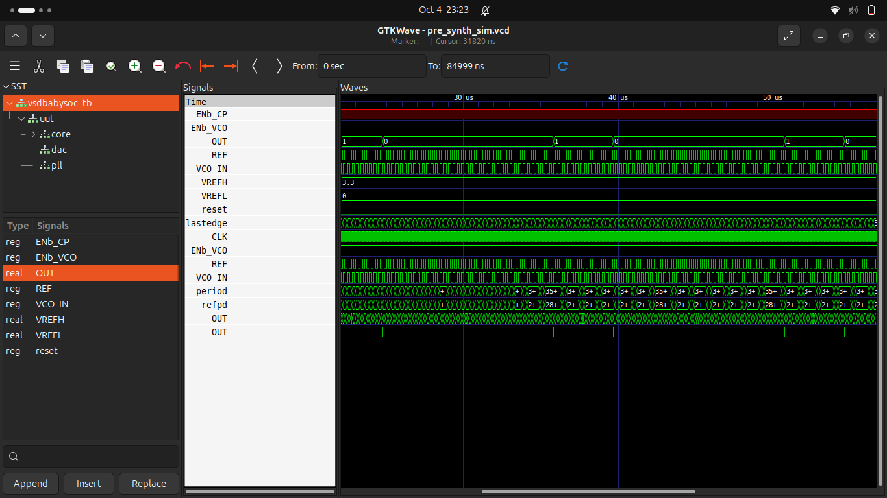

# 🧩 What Makes Up VSDBabySoC?
At its heart, VSDBabySoC is a mini-System-on-Chip:

###  RVMYTH (RISC-V CPU Core) 🧠
* Fetches & executes instructions.
* Drives output data through register r17.
### Phase-Locked Loop (PLL) ⏱️

* Generates a clean, stable internal clock from an input source.
### Digital-to-Analog Converter (DAC) 🎚

* Takes the 10-bit value from the CPU (r17) and outputs a proportional analog voltage.
#### 💡 Concept:
Think of the CPU as the brain, the PLL as the heartbeat, and the DAC as the voice — all working together to make the chip “speak” in analog.

## 📂 Project Structure

```bash
VSDBabySoC/
├── src/
│   ├── include/      # Header files (*.vh)
│   ├── module/       # Verilog + TLV modules
│   │   ├── vsdbabysoc.v   # Top-level module
│   │   ├── rvmyth.v       # CPU
│   │   ├── avsdpll.v      # PLL
│   │   ├── avsddac.v      # DAC
│   │   └── testbench.v    # Testbench
└── output/           # Simulation outputs
```
### 🛠️ Setup
#### 📥 Cloning the Project
```bash
cd ~/VLSI
git clone https://github.com/manili/VSDBabySoC.git
cd VSDBabySoC/
```
#### 📂 You’ll see:

* src/ (modules)
* images/ (visuals)
* output/ (simulation results)
## 🔧 TLV → Verilog Conversion
Since RVMYTH is written in TL-Verilog (.tlv), we need to convert it to Verilog before simulating.
```bash
# Install tools
sudo apt update
sudo apt install python3-venv python3-pip

# Create virtual env
python3 -m venv sp_env
source sp_env/bin/activate

# Install SandPiper-SaaS
pip install pyyaml click sandpiper-saas

# Convert TLV → Verilog
sandpiper-saas -i ./src/module/*.tlv -o rvmyth.v --bestsv --noline -p verilog --outdir ./src/module/
```
✅ Now you’ll have
```
rvmyth.v
```
 alongside your other Verilog files.

 ### 🧪 Simulation Flow
#### 🔹 Pre-Synthesis Simulation
```bash
mkdir -p output/pre_synth_sim

iverilog -o output/pre_synth_sim/pre_synth_sim.out \
  -DPRE_SYNTH_SIM \
  -I src/include -I src/module \
  src/module/testbench.v

cd output/pre_synth_sim
./pre_synth_sim.out
```
#### 📊 View in GTKWave:
```bash
gtkwave output/pre_synth_sim/pre_synth_sim.vcd
```
#### 🔍 Signals to Observe
* ⏱️ CLK → Input clock (from PLL)
* 🔄 reset → Reset signal
* 🎚 OUT (DAC) → Output from DAC (appears digital in sim)
* 🔢 RV_TO_DAC[9:0] → 10-bit RVMYTH output → DAC input

  
  
